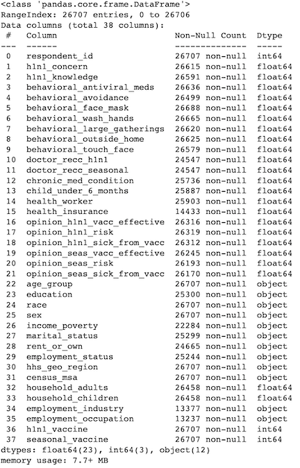
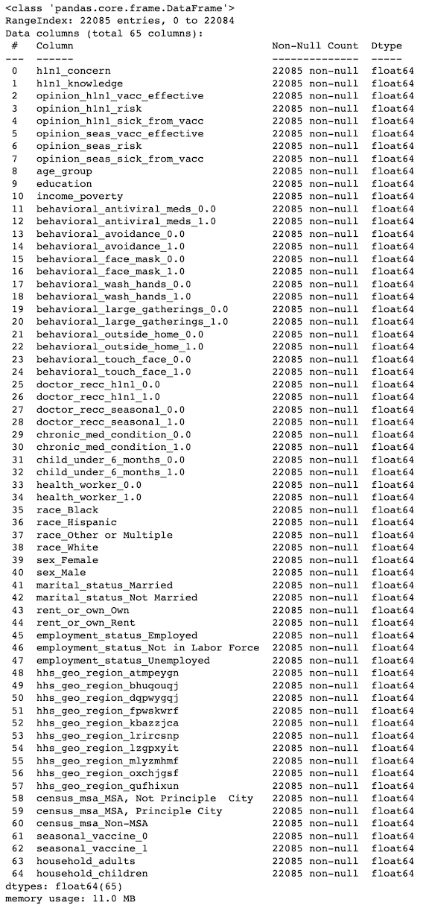
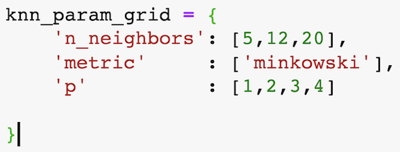
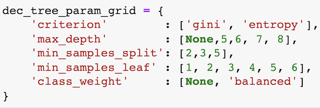
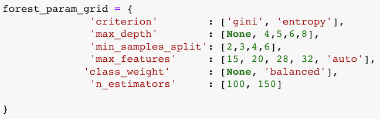
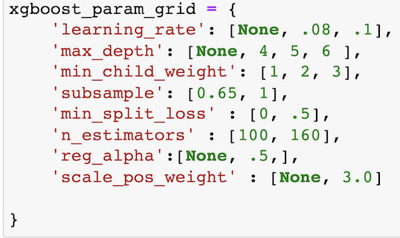
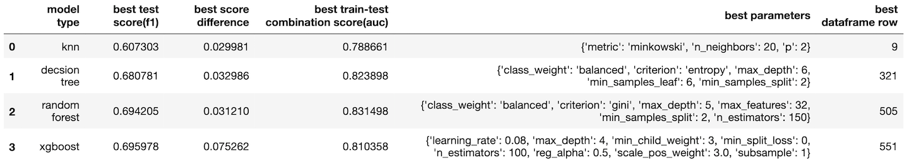
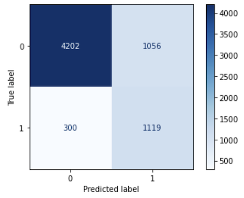

&emsp;&emsp;&emsp;&emsp;&emsp;&emsp;&emsp;&emsp;&emsp;&emsp;&emsp;&emsp;&emsp;&emsp;&emsp;&emsp;&emsp;&emsp;&emsp;&emsp;&emsp;&emsp;&emsp;


# Using a Classification Model to Predict Who is More Likely to Take the H1n1 Flu Vaccine

**Author:** Freddy Abrahamson<br>
**Date created:** 3-27-2022<br>
**Discipline:** Data Science
## Overview
For this project, I will be comparing different models:

* Knn
* Decision Trees
* Random Forest
* XGBoost

I will run these models with different hyperparameters, to see which one can best predict if a person will, or will not take the h1n1 flu vaccine. I will use the F1 score as my metric.

## Business Problem

As a consequence of the Covid 19 pandemic, there is a renewed interest in the vaccination rates for the seasonal flu. A governmental agency is performing an exploratory analysis to identify who is more lilely to take the seasonal flu vaccine.


## Data Understanding
***
The data comes from the National 2009 H1N1 Flu Survey ('H1N1_Flu_Vaccines.csv'). The data is comprised of 36 columns, including the target variable, and 26,707 rows. Each row represents a respondent in the survey. The target variable, 'h1n1_vaccine', is a binary variable which represents whether the respondent took the vaccine or not. The distribution of the labels is the following:

Raw Counts<br>
0:&emsp;&emsp;21033<br>
1:&emsp;&emsp;5674<br>
Name: h1n1_vaccine, dtype: int64

Percentages<br>
0:&emsp;&emsp;0.787546<br>
1:&emsp;&emsp;0.212454<br>
Name: h1n1_vaccine, dtype: float64<br>


The survey is primarily comprised of binary and multiple choice questions such as:

* 'h1n1_knowledge':&emsp; 0 = No knowledge&emsp;1 = A little knowledge&emsp; 2 = A lot of knowledge
 
*  'health_worker'(binary):&emsp; 0 = no&emsp; 1 = yes


For complete information on the dataset:
https://www.drivendata.org/competitions/66/flu-shot-learning/page/211/<br><br><br>

**<font size='3'>Original Dataframe Before Any Modification:</font>**<br>
<br><br><br>

df.head()
## Preprocessing Data

<font size='3'>1.&emsp;I will drop certain features:<br>
&emsp;&emsp;1.&emsp;'respondent_id' - since it is a unique identifier<br>
&emsp;&emsp;2.&emsp;'employment_industry','employment_occupation', and 'health_insurance' - about 50% or more records are missing<br> 
2.&emsp;Split the dataframe between the predictors and the dependent variable. The dependent variable is "h1n1_vaccine".<br> 
3.&emsp;Perform a stratified train/test split (default 75%/25%), so that the training and test data sets have the same ratio of minority labels to majority labels.<br>
4.&emsp;Impute all missing values based on most common value in their respectivs columns, on both the training and test sets.<br>
5.&emsp;Applying one-hot encoding, and ordinal encoding to the necessary columns on the training set.
6.&emsp;Applying SMOTE(sampling_strategy=0.40), so that the minority class is 40% of the majority class.<br>
7.&emsp;Applying one-hot encoding, and ordinal encoding to the necessary columns on the test set.
</font><br><br><br>

**<font size='3'>The following is a description of the scaled dataframe after the preprocessing was completed:</font>**<br>
<br><br><br>

# Classification models:<br>
<font size='3'>I will create 4 different models: knn, decsion tree, random forest, and XGBoost. I will create a baseline model of each, as well as variations on the same model using GridsearchCV. Iwill use the f1 score as a metric. <br>
1.&emsp; Knn basline score: 64.39%<br>
&emsp; &emsp;knn gridsearch parameters:<br>
<br><br><br>
2.&emsp; Decision Tree basline score: 60.26%<br>
&emsp; &emsp;Decision Tree gridsearch parameters:<br>
<br><br><br>
3.&emsp; Random Forest basline score: 66.96%<br>
&emsp; &emsp;Random Forest gridsearch parameters:<br>
<br><br><br>
4.&emsp; XGBoost basline score: 62.14%<br>
&emsp; &emsp;XGBoost gridsearch parameters:<br>
<br><br><br>

# Choosing the Best Model:<br>
**<font size='3'>The best model is Random Forest (based on the auc score):</font>**<br>
<br><br><br>


# Recreating the  the Best Model:<br>
**<font size='3'>After recreating the best model (Random Forest), with the parameters specified on the dataframe, we recieved an f1 score of 0.6227045075125209.</font>**<br>
**<font size='3'>Confusion Plot for the best model::</font>**<br>
<br><br><br>


# Recommendations
<b>metric</b>: F1 score

<b>model</b>: Random Forest

<b>model parameters</b>: class_weight = 'balanced', criterion = 'gini', max_depth = 5,<br>
                         max_features = 32, min_samples_split = 2, n_estimators = 150,<br>
                         random_state = 42, n_jobs = -1<br>
                              
<b>how to handle class imbalance</b> &emsp;: Get more questionaires with respondents who are taking the vaccine, in order to balance the data. As it stands now, the ratio of respondents who have not taken the vaccine, to those who have, is almost 4:1. Short of that, using SMOTE(sampling_strategy=0.40) gave the best results.

 

<b>Recommend to place a special emphasis on the following features, since they account for more
than 99% of toal feature importance metric (decrease in the gini impurity score):</b>
* seasonal_vaccine
* doctor_recc_h1n1
* doctor_recc_seasonal
* opinion_h1n1_vacc_effective
* opinion_h1n1_risk
* health_worker<br><br>

<b>I believe that this small reduction in the 'feature importance metric' could be offset by having a considerably shorter questionnaire, with only six questions, thereby having more people successfully completing them.</b><br><br><br>


# Project Conclusion: Main Take-aways


1. This project helped me appreciate that there a few things that should be done prior to working with the models:<br>
      <ol> 
       1. Clearly define a question, or goal that would be resolved by the model.<br>
       2. Choose a metric that would best measure the success of your model,as it pertains to your goal.<br>
       3. Try to define a naive strategy, and its success rate, so you have something to compare your model to.
      </ol><br>
      
2. My goal in this project was to create a model that would identify, as correctly as possible, who will, and who won't take the h1n1 vaccine. My prediction results could be            categorized as any of the following four:<br>
    <ol>       
     1. True positive: The respondent was predicted to have taken the vaccine, and actually took it.<br>
     2. True negative: The respondent was predicted not to have taken the vaccine, and did not take it.<br>
     3. False positive: The respondent was predicted to have taken the vaccine, but did not take it.<br>
     4. False negative: The respondent was predicted to not have taken the vaccine, but actually took it.
    </ol><br>
3. Given that my goal is to be as 'accurate' as possible, there is no upside in identifying one class more aggresively than the other. I chose the F1 metric because it does a           good job of minimizing false positives, and false negatives on an imbalanced data set.<br>

4. I used the auc function to determine the best train/test score combination. I set the difference between the train and the test scores as the x axis, and the test score itself as the y axis. Based on this the Random Forest model was the best.<br>
5. I would consider finding the optimal threshold for each model, and see if that makes a difference.<br>


## For More Information

Please review my full analysis in [my Jupyter Notebook](./student.ipynb) or my[presentation](./DS_Project_Presentation.pdf).<br>
For any additional questions, please contact **Freddy Abrahamson at fred0421@hotmail.com**,<br><br>

## Repository Structure

```
├── README.md                                    <- The top-level README for reviewers of this project
├── student.ipynb                                <- Narrative documentation of analysis in Jupyter notebook
├── Phase_3_Project_Presentation.pdf             <- PDF version of project presentation
└── images                                       <- Images used for this project
```
